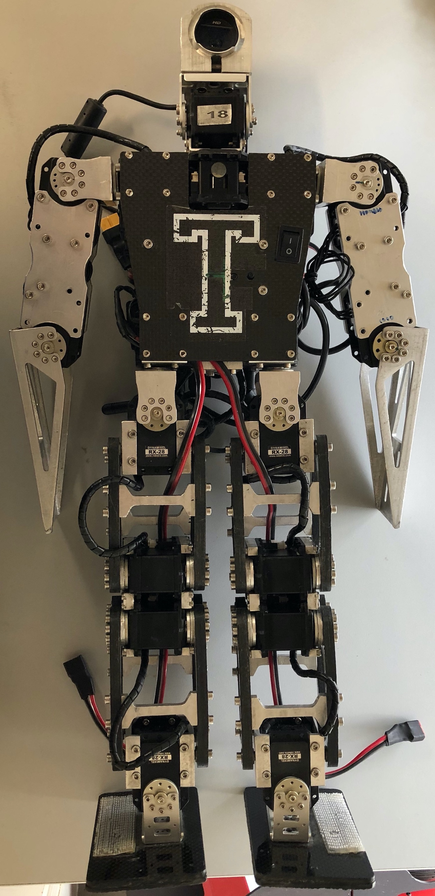
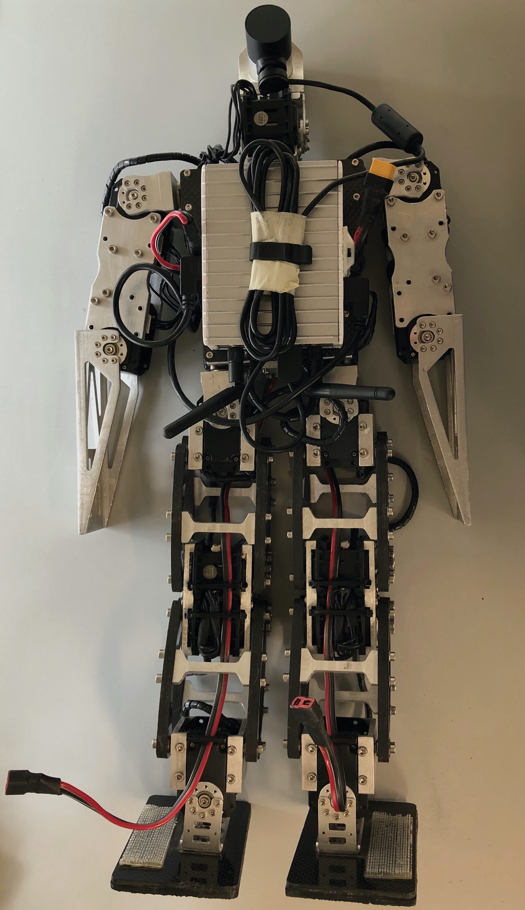
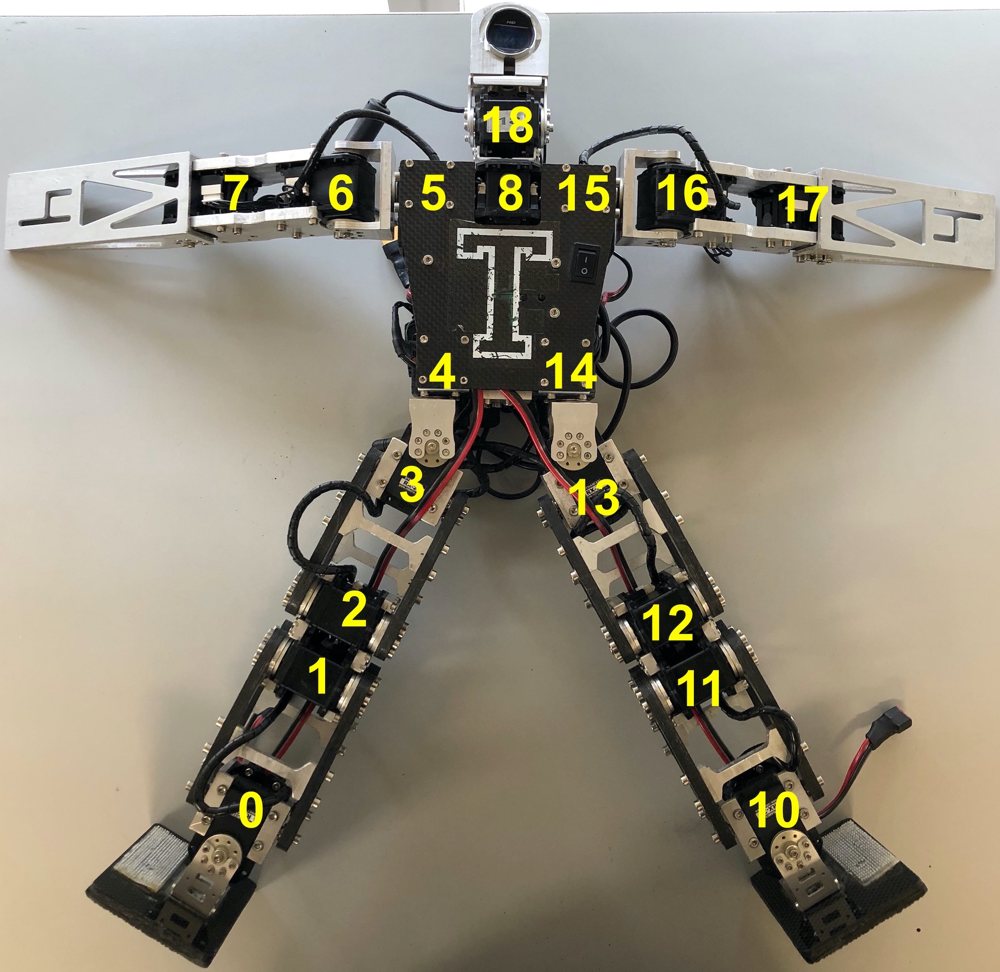
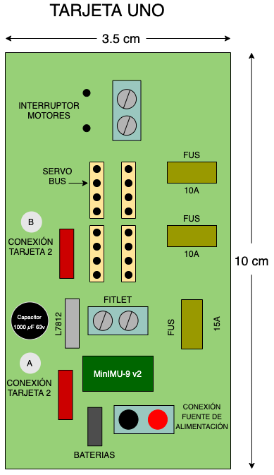
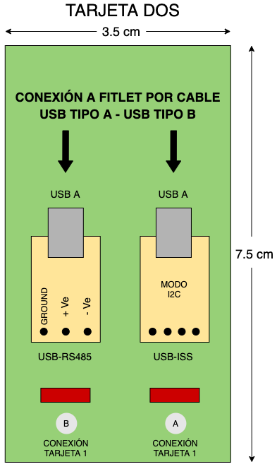

# Bogobot v2
Manual del robot humanoide: Bogobot v2

# Información general
El robot humanoide Bogobot es un desarrollo creado en el Tecnológico de Monterrey Campus Estado de México a lo largo de los años, el cuál ha sufrido constantes cambios y actualizaciones en pro de un mejor desempeño en competencias, así como para el aprendizaje de los estudiantes que interactuan con él.

    <table>
	    <tr>	
    	    <td align="center" valign="center" style="padding:5px">
        	    
		     
		    <b>Vista frontal</b>
      	    </td>
            <td align="center" valign="center" style="padding:5px">
            	
		 
		    <b>Vista trasera</b>
             </td>
        </tr>
    </table>

## Elementos principales
  * Cámara [Microsoft LifeCam Studio](https://www.microsoft.com/accessories/es-es/products/webcams/lifecam-studio/q2f-00009)
  * Minicomputadora [Fitlet-i](https://www.fit-pc.com/web/products/fitlet/fitlet-i/)
  * 18 servomotores Dynamixel de ROBOTIS, de los cuáles son de dos tipos diferentes: [RX-24F](http://emanual.robotis.com/docs/en/dxl/rx/rx-24f/) y [RX-28](http://emanual.robotis.com/docs/en/dxl/rx/rx-28/)
  * Dos Cables [USB A macho a B macho](https://www.trossenrobotics.com/store/p/6611-USB-A-Male-to-B-Male-6ft-Cable.aspx)
  * Pololu [MinIMU-9 v2](https://www.pololu.com/product/1268) o versiones más actualizadas.
  * Módulo de comunicación [USB-ISS](https://www.robot-electronics.co.uk/htm/usb_iss_tech.htm)
  * Adaptador [RS-485](http://www.robot-electronics.co.uk/htm/usb_rs485_tech.htm)
  * Fuente de alimentación [MEAN WELL SE-600-15](https://www.meanwell.com/webapp/product/search.aspx?prod=SE-600)
  * Dos Baterias de Polímero de Litio:
    * Capacidad - 2100mAh
    * Voltaje - 7.4V
    * No. de Celdas - 2
    * Tasa de descarga - 25C
    * Nomenclatura - 2SP

## Estructura
El Bogobot cuenta con 18 motores Dynamixel distribuidos en su tronco, piernas, brazos y su cabeza, se muestra un diagrama con los ID's de los motores.

  

En su interior cuenta dos tarjetas principales, las cuáles se utilizan para los motores (BUS), alimentación, sensores, interfaces, etc. A continuación de muestran los diagramas de dichas tarjetas.

    <table>
	    <tr>	
    	    <td align="center" valign="center" style="padding:5px">
        	
      	    </td>
            <td align="center" valign="center" style="padding:5px">
            	
             </td>
        </tr>
    </table>

## Software
Para el funcionamiento del Bogobot, se utiliza el sistema operativo Ubuntu 16.04 y ROS (C++), con el fin de una mayor eficiencia en el desempeño general del robot. Para conocer más acerca de Ubuntu, se recomienda leer a detalle la documentació
n oficial [1], así como ROS Kinetic, el cuál su información se puede encontrar en la siguiente referencia [2].

* [Instalación de Ubuntu (Por medio de una USB)](https://ubuntu.com/tutorials/tutorial-install-ubuntu-desktop-1604#1-overview)
* [Instalación de ROS Kinetic](http://wiki.ros.org/kinetic/Installation/Ubuntu)
* Otras instalaciones importantes dentro Ubuntu (Recordatorio: Es importante que en cada instalación se corra antes el siguiente comando `sudo apt-get update`):
	* Gedit: `sudo apt-get install gedit`
	* Intalación catkin‐tool de Python: `sudo apt-get install python-catkin-tools`

## Programas
Se pone a disposición repositorios de programas realizados en ROS, con los cuáles se ha construido el software del funcionamiento del Bogobot para efectuar sus principales tareas. **Estos repositorios se deberán de leer detalladamente para que el funcionamiento de los componentes sea el correcto.**

* [Comunicación del módulo USB-ISS y el Pololu MinIMU-9 v2 (Giroscopio, Magnetómetro y Acelerómetro)](https://github.com/JuanCarlos-MA/USB-ISS_minimu9_and_buttons)
* [Instalación y uso de los servomotores Dynamixel](https://github.com/aaceves/example_dynamixel)

## Autor

**Juan Carlos Martínez Aguilar** *Estancia de Investigación en Robots Humanoides*

## Referencias
1. Ubuntu, "Official Ubuntu Documentation," [Online]. Available: https://help.ubuntu.com/?_ga=2.92983901.1953744592.1580950975-1107685300.1580950975. [Accessed 25 January 2020].
2. ROS.org, "ROS Kinetic Kame," 08 January 2018. [Online]. Available: http://wiki.ros.org/kinetic. [Accessed 14 January 2020].
